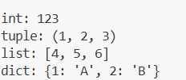

# 🚀 Python Type Conversion Playground

A visually appealing and beginner-friendly reference guide demonstrating core data type conversions in Python. This project highlights practical examples of transforming strings, lists, and tuples dynamically.

---

## 💻 Python Source Code

Here is the clean implementation used for performing the type casting operations:

```python
# 1️⃣ Converting String to Integer
mystring = "123"
print("int:", int(mystring))

# 2️⃣ Converting List to Tuple
mylist = [1, 2, 3]
print("tuple:", tuple(mylist))

# 3️⃣ Converting Tuple to List
mytuple = (4, 5, 6)
print("list:", list(mytuple))

# 4️⃣ Converting List of Key-Value Pairs to Dictionary
mylist_pairs = [(1, 'A'), (2, 'B')]
print("dict:", dict(mylist_pairs))
```

---

## 📸 Program Output Screenshot

Below is the verified execution terminal output snapshot:

<p align="center">
  
</p>

> ⚠️ **Setup Hint:** Save your uploaded image as `output.png` in the root folder of your repository, or update the `src` attribute with your exact image path to render it properly on GitHub.

---

## ⚙️ Quick Execution Guide

### Prerequisites
Ensure Python 3.x is correctly configured on your terminal path:
```bash
python --version
```

### Run the Script
1. Clone or download this project setup.
2. Trigger the code execution from your command-line interface:
```bash
python main.py
```

---

## 🛠️ Built & Documented With

*  - Engine Language
*  - Documentation Style
